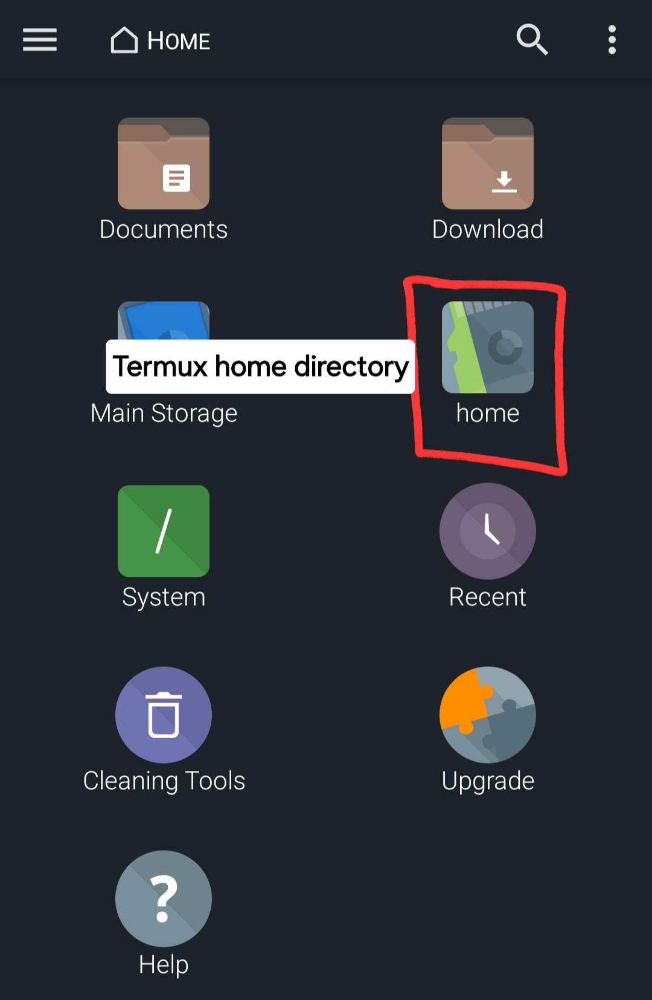

NOTE ABOUT checking ToS and robots.txt to see if they allow scraping.

## How to Use

### Download Required Apps and Set Permissions:
1. On your phone, download and install F-Droid  [here](https://f-droid.org/en/).
    * You may be prompted to set permissions to allow the installation of the .apk file.
2. Install Termux from the F-Droid app ([for reference](https://f-droid.org/en/packages/com.termux/)).
    * DO NOT install Termux from the from Google Play Store as Termux has halted updates through the Google Play Store.
    * You may be prompted to allow app installs from this source.
3. Install Termux:API from the F-Droid app ([for reference](https://f-droid.org/en/packages/com.termux.api/)).
4. Install FX File Explorer from the <u>Google Play store</u> ([for reference](https://play.google.com/store/apps/details?id=nextapp.fx)).
5. Navigate to `Settings > Apps > Termux` and allow Termux to send notifications. Do the same for Termux:API.
6. Navigate to `Settings > Apps > Termux` and check Termux for battery-related settings and set them to "unrestricted," or otherwise to not be optimized for battery life. Do the same for Termux:API.
7. Navigate to `Settings > Apps > three-dot menu > Special Access > All files access > FX` and enable access.
8. In `Settings > Battery`, check `Background usage limits > Never auto sleeping apps` for any Termux related apps.
    * As of Android 14, turning off battery optimization removes them from this list, but you should still check here to make sure there's no optimization happening.

### Configure FX File Explorer: STORAGE PERMISSIONS?
If you have trouble, you may optionally check out [this guide](https://imgur.com/a/NDkpeaz). The pictures aren't exact, but they're useful.
1. Open Termux and give it a second to install the bootstrap packages. You can exit the app afterwards.
2. Open FX File Explorer.
3. There may be a warning message at the bottom stating that FX needs access to read/write files etc. in order to function. Select `ENABLE ACCESS`.
4. Open the three-dots menu and select `Connect to Storage`.
5. Open the three-lines menu and select `Termux`.
6. Select `USE THIS FOLDER`. Allow FX to access files in Termux.
7. Return to the FX File Explorer home page. The Termux `home` directory is now available for navigation.

### Job Scraper Download and Configuration:
1. <u>On your Android phone</u>, downlaod the .tar.gz file containing the latest release [here](https://github.com/Highway-Kebabbery/Job-Scraper/releases/).
2. In FX File Explorer, locate the compressed project file inside `Downloads`. Move the compressed project file to the Termux home directory.

    

3. Open Termux.
4. Ensure you are in `/data/data/com.termux/files/home/`.
5. Run: `ls`. You should see the compressed project folder.
6. Run: `tar -xf <project-folder-name.tar.gz>` to extract the files here.
    * The extracted project folder MUST be in `/data/data/com.termux/files/home/` to run.

***#$$$$$$$$$$$$&&^%#$%$%NOTE: INSTALLATION IS VALIDATED THROUGH HERE. I STILL NEED TO TEST THE STEPS BELOW.***

For the first execution:

7. Run: `chmod +x ./<project-folder-name>/src/scripts/setup.sh` to give the setup script execute permissions.
8. Run: `./<project-folder-name>/src/scripts/setup.sh` to configure Termux to run the job scraper.

For subsequent executions if the job is stopped:

9. Open Termux and ensure you're in the home directory. Run `./<project-folder-name>/src/scripts/schedule_scrape_jobs.sh`.

******HEYHEYHEY HEY HEY HERE'S A NOTE. LET THEM KNOW ABOUT POTENTIAL SETUP ERROS.
*****Note: Force-quit the app if it begins entering "y" in an infinite loop. It's happened to me on very rare occasions.
Note about having mirror groups for NA, SA, and Europe. Recommend reordering them based on location.

A big thank you to [luanon404](https://github.com/luanon404/Selenium-On-Termux-Android?tab=readme-ov-file) for their help with getting Termux set up for Selenium.

***BE SURE TO ADD A NOTE ABOUT ADDING NEW COMPANIES
***Will need to add screen recording of the app working when it's all running in the final implementation.

Learned:
If there's too much HTML, you can't print all to the console. Save to a file to see it all.
Learned about docstrings
Got to practice building Python classes
Termux halted all updates on google play. Thanks Peter Mortensen on Stack Exchange. You saved my life.
Learned how to send a system command from a python script, capture the result, and store it in a variable for later use in the script.
Learned that os.popen('pwd').read() adds a newline character to the end which gave me a lot of trouble =___=