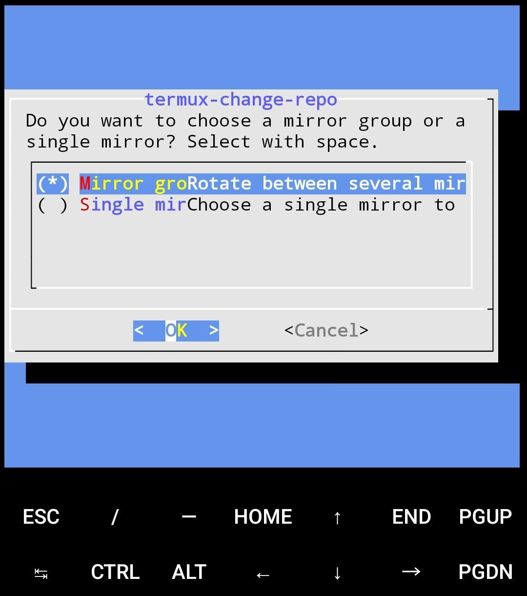
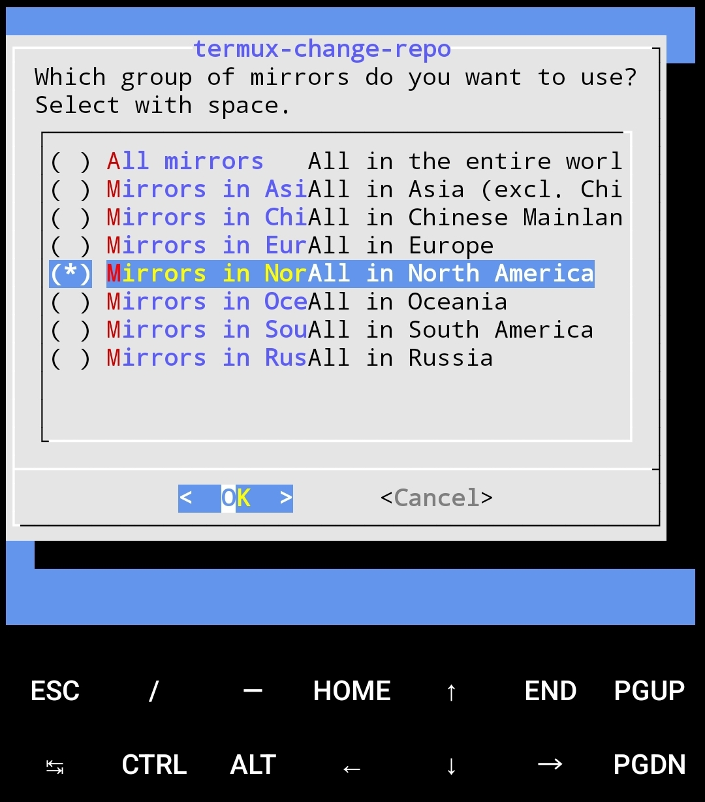
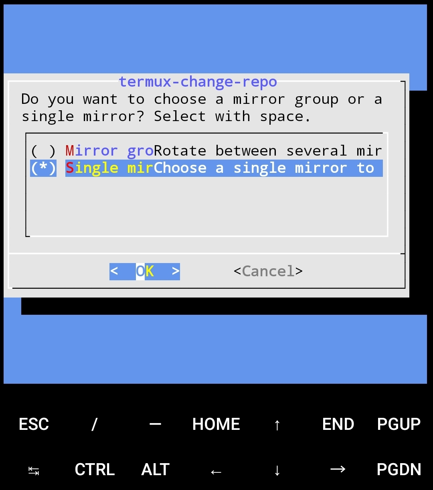
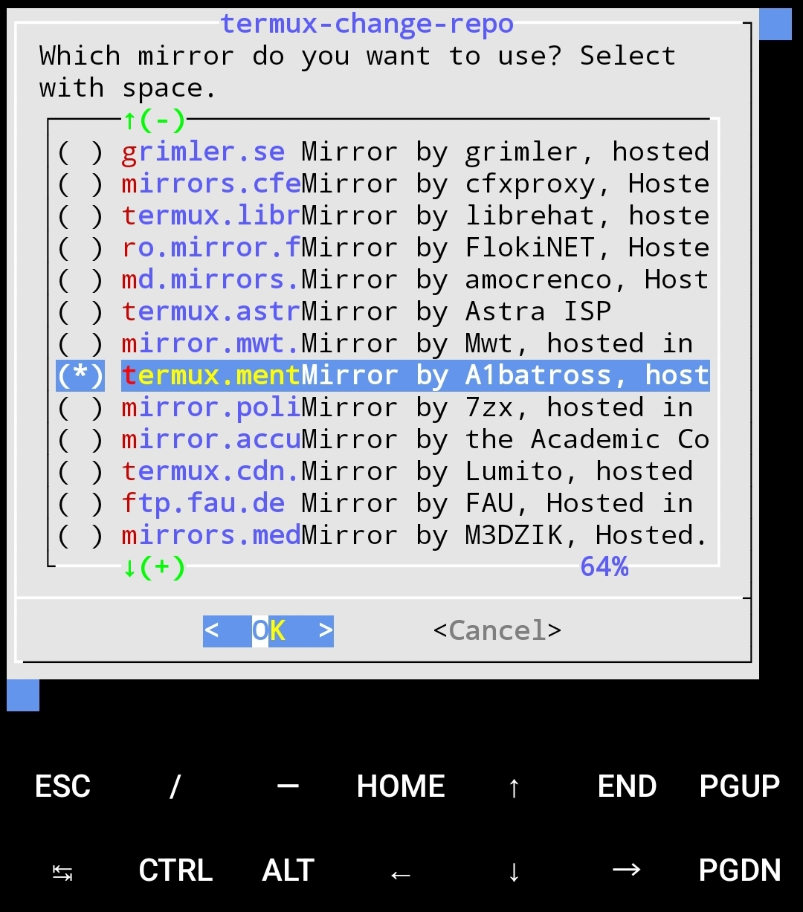
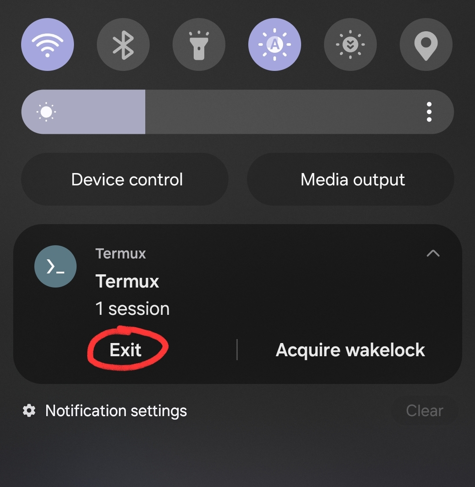

# 
Job Scraper

MAIN WORK OUTSTANDING:
* Finishing the README:
    * I need to add a screen recording of the app working when it's all running in the final implementation so that potential employers don't need to bother with trying to isntall. Use the "updates detected" notifications to show full functionality.
        * ***Start preparing for this 15 minutes beforehand so I get it in one go.***
            * Open Termux. Type in the command to run scrape_jobs.py manually. DO NOT SEND.
            * Navigate to the home screen.
            * Locate screen recording function and try it once to make sure I know what to expect.
            * Open Google Chrome to a new tab (so there's no possibility of personal info being displayed).
            * Open Clock > World Clock to see what the current time is to the second.
            * Go to the "all apps" screen and close everything but Termux, Chrome, and Clock (for privacy).
                * Make sure the apps suggested on the bottom are not incriminating (not that I have anything that's actually incriminating).
            * CLEAR ALL NOTIFICATIONS CONTAINING PERSONAL DATA.
            * Begin recording 60 seconds before the daily notification arrives.
                * Can record the clock screen to avoid showing personal data.
            * After notification arrives, pull down notifications to display it and expand it.
                * DO NOT CLICK IT ON ACCIDENT.
            * Without clearning notification, nav to Termux.
            * Send the manual script execution command.
                * OPEN NOTIFICATIONS BEFORE IT FINISHES.
            * Watch per-execution notification come in.
            * Expand any notification and dismiss it.
            * Expand the daily notification and click on it.
                * Capture the launch of the company site.
            * Stop recording.
* FOR THE LOVE OF GOD, SET THE PROJECT VERSION BEFORE YOU RELEASE IT AGAIN.
* ALSO FOR THE LOVE OF GOD, REMEMBER TO TURN OFF FAST NOTIFICATIONS IN THE PYTHON SCRIPT BEFORE PUBLISHING THE FIRST STABLE RELEASE.
*****
*****
*****
*****
*****

## Description
This application alerts users of updates to a specified company's (or companies') "Careers" page via notifications on their Android phone. This is acheived by using Termux, Selenium, and Beautiful Soup on an Android phone to scrape web content, by using `cronie` to schedule Python script execution in Termux, and by using the `at` service to schedule single-occurrence events such as sending notifications to the user's phone. **Note:** This application does **not** require rooting of the Android phone.

## Features
### Current:
* One daily notification per company is scheduled for 1000 each day with a summary of yesterday's findings.
* When changes to a given company's "Careers" page are detected, all subsequent executions for that day send a notification to the user's phone to increase visibility.
* The scraper is periodically scheduled as a cronjob, so the frequency can be easily changed.
* The scraper captures all job listings by navigating through "Careers" sections with multiple pages using Selenium.
* Note that the application currently only checks for *updates* to company listings, so a listing removal will trigger the "listings updated" notification.

### Planned:
The application is currently only configured to target smaller companies with a relatively small number of job listings. Some of the following planned features will allow for targeting larger companies which may have a vast number of listings that are unrelated to the user.
* Detect only the addition of new jobs as opposed to detecting any change at all.
* Filter job listings by specified keywords to narrow the search.
    * As a result, notifications could meaningfully contain the actual job titles available for application.
    * The drawback to this feature is that I may miss jobs that I am interested in if I do not use an expansive enough set of keyword filters. Even still, some interesting jobs may be missed.
    * The benefit to this feature is that I could target much larger companies that have a higher quantity of irrelevant listings.
* I could conceivably condense all available listings at all tracked companies into one text file that is built daily and linked-to in the daily notification.
    * This would be useful if I am tracking so many companies that receiving one notification per company is cumbersome. However, it is not the most pragmatic feature to work on right now.
* For the match-case statement in `CompanyJobsFinder.set_current_jobs()`, I will eventually need to figure out which kwarg works for each selector. I've only verified this for `'class name'` so far.
    * I will do this on an as-needed basis and I expect that anybody with the ability to use this script for their own purpose could do the same.

## How to Use

### Software Requirements
* Android 14
    * Untested on other versions.
* Termux App
    * MUST be downloaded from F-Droid. The Google Play Store version is no longer supported, does not even contain all required packages, and thus will not function.
* Termux:API app
    * Downloaded from F-Droid
* FX File Explorer or equivalent
* Python v3.11.9
    * Untested on other versions.
* Selenium v4.9.1
    * Other versions untested. This version was specifically recommended, without reason, by the resource I used to get Selenium working.
    * Thank you to [luanon404](https://github.com/luanon404/Selenium-On-Termux-Android?tab=readme-ov-file) for their help with getting Selenium set up for Termux, and getting Termux set up in general.
* Beautiful Soup v4.12.3
    * Untested on other versions

### Initial Setup:
#### Download Required Apps and Set Permissions:
1. On your phone, download and install F-Droid  [here](https://f-droid.org/en/).
    * You may be prompted to set permissions to allow the installation of the .apk file.
2. Install Termux from the F-Droid app ([for reference](https://f-droid.org/en/packages/com.termux/)).
    * DO NOT install Termux from the from Google Play Store as Termux has halted updates through the Google Play Store.
    * You may be prompted to allow app installs from this source.
3. Install Termux:API from the F-Droid app ([for reference](https://f-droid.org/en/packages/com.termux.api/)).
4. Install FX File Explorer from the <u>Google Play store</u> ([for reference](https://play.google.com/store/apps/details?id=nextapp.fx)).
5. Navigate to `Settings > Apps > Termux` and allow Termux to send notifications. Do the same for Termux:API.
6. Navigate to `Settings > Apps > Termux`, check Termux for battery-related settings, and set them to "unrestricted" or otherwise to not be optimized for battery life. Do the same for Termux:API.
7. Navigate to `Settings > Apps > Termux > Draw over other apps` and allow permission, otherwise `--action termux-open-url` won't open webpages from the notification.
8. Navigate to `Settings > Apps > three-dot menu > Special Access > All files access > FX` and enable access.
9. In `Settings > Battery`, check `Background usage limits > Never auto sleeping apps` for any Termux related apps.
    * As of Android 14, turning off battery optimization removes them from this list, but it is best practice to ensure absolutely no battery optimization happens for these apps.

#### Configure FX File Explorer:
If you have trouble, you may optionally check out [this guide](https://imgur.com/a/NDkpeaz). The pictures are not exact, but they are useful.
1. Open Termux and give it a moment to install the bootstrap packages. You can exit the app afterwards.
2. Open FX File Explorer.
3. There may be a warning message at the bottom stating that FX needs access to read/write files etc. in order to function. Select `ENABLE ACCESS`.
4. Open the three-dots menu and select `Connect to Storage`.
5. Open the three-lines menu and select `Termux`.
6. Select `USE THIS FOLDER`. Allow FX to access files in Termux.
7. Return to the FX File Explorer home page. The Termux `home` directory is now available for navigation.

#### Job Scraper Download and Configuration:
1. <u>On your Android phone</u>, downlaod the .tar.gz file containing the latest release [here](https://github.com/Highway-Kebabbery/Job-Scraper/releases/).
2. In FX File Explorer, locate the compressed project file inside `Download`. Move the compressed project file to the Termux home directory.

    

3. Open Termux.
4. Run `pwd` to ensure that you are in `/data/data/com.termux/files/home/`.
5. Run `ls`. You should see the compressed project folder.
    * Note: You should only have one version of the project downloaded at any given time. Remove old versions before upgrading by running `rm -r Job-Scraper-<old version>` from the home directory.
6. Run: `tar -xf Job-Scraper-<version number>.tar.gz` to extract the files here.
    * The extracted project folder MUST be in `/data/data/com.termux/files/home/` to run.
7. Run `chmod 700 -R Job-Scraper-<version number>` to set permissions.
8. Run `./Job-Scraper-<version number>/src/scripts/_setup.sh` to configure Termux to run the job scraper.
9. When prompted, select a mirror group by using the arrow keys to navigate, `space` to select, and `enter` to save the selection.

    
    

    * It is necessary to choose a mirror because the Termux host server is no longer maintained.
    * A mirror *group* may not always be available for selection. In that case, choose an individual mirror.

        
        

    * In the unlikely event that the installation fails, run `./Job-Scraper-<version number>/src/scripts/_setup.sh` again and try selecting a different mirror group. It may take several attempts.
    * Mirrors are only required when installing/updating packages and dependencies. In the event that a connected mirror goes down, execute `termux-change-repo` from the command line to select a new mirror.
10. When prompted, choose whether to grant Termux access to device storage.
    * This step is optional for this project, but it facilitates command line access of the files in device storage.
    * To set up Termux storage access at a alter time, execute `termux-setup-storage` from the command line. **You must completely exit Termux after executing this command.**
11. When setup finishes, COMPLETELY exit Termux. To do so, use the `Exit` option in the Termux persistent notification.

    

12. Setup is complete once Termux has been completely exited.

### Operation:
**Notes:** If for any reason a file is moved out and back in to the parent directory on the mobile device, you will need to reset permissions for that file. `chmod 700 -R <parent_directory>` will set permissions for all files/directories when run from the home directory.

1. Executing the script:
    * Open Termux, ensure you are in the home directory, and run `./Job-Scraper-<version number>/Schedule_Job_Scraper.sh`.
    * To check whether the job was started, run `crontab -l`.
        * If the job was started, then `crontab -l` will display `0 */3 * * * /data/data/com.termux/files/home/Job-Scraper-*/src/scrape_jobs.py`.
        * Check the text file at `Job-Scraper-<version number>/logs/execution_log.csv` for evidence of continuous execution
    * To stop the job, run `crontab -e` and comment out the cronjob by adding `#` to the front of it.
        * Alternatively, the job can be deleted from within the crontab editor.
        * Alternatively, `crontab -r` will delete **all** active cronjobs from the crontab.
    * The application is designed to treat the first day of scraping a company website as a positive listing update identification, so it will send a notification on every execution that day.
        * This cronjob, `0 */3 * * *`, will run at 0000, 0300, 0600, 0900, 1200, 1500, 1800, 1900, and 2100 every day regardless of the time at which it was started.
    * **Note:** For continuous execution, Termux must be left open in the background.
        * When finished in Termux. Exit to the home screen of the phone and resume normal use. Leave Termux open in the "all apps" page. Leave the persistent Termux notification in the notifications bar.
        * The program does appear to run with the same consistencty when Termux is "closed" from the "all apps" page, but it's absolutely necessary to leave the persistent Termux notification in the notifications bar.
2. Adding companies to track:
    * Read the main() docstring within scrape_jobs.py for detailed context on the Python script's functionality.
    * To track new companies:
        * Check the company's robots.txt and respect their wishes.
        * Testing is easier on a Windows desktop. Comment out the main() entry point and uncomment the desktop_scraper() entry point.
        * Follow the instructions in the desktop_scraper() docstring to test the scraper on new companies.
        * In main(), create and fill out a new company attributes list and then add that list's name to `companies`.
        * Re-comment the desktop_scraper() entry point and uncomment the main() entry point after testing.
3. Changing execution frequency:
    * Either edit Schedule_Job_Scraper.sh or run `crontab -e` in Termux to edit the cronjob.
4. Intermittent failure:
    * Termux will occasionally be affected by background processes of the Android device. The main clue that execution has stopped is the failure of a daily notification to appear for each tracked company at 1000.
    * To resume execution: open Termux, run `crontab -e`, make and save a minor edit to a cronjob, then run `crontab -e` again and set the altered cronjob back to its original setting.
        * There may be other ways to resume execution, but this has worked for me.

## Technology
* **Python:** I chose Python for several reasons:
    * It is an appropriate tool for the job when considering both the language and the available libraries (namely: Selenium and Beautiful Soup).
    * Having experience in these libraries will likely be valuable for me as an employee in the future.
    * I know it.
    * **Selenium:** Selenium was required to deal with dynamically loaded webpages. It allows me to wait to collect the html until everything I need has loaded, and it is also a widely used and well-vetted tool for this job.
    * **Beautiful Soup:** Beautiful Soup is a widely-used library for parsing html. 
* **Termux:** Termux is an emulated command line providing a Linux environment on an Android phone. I chose to implement this application with Termux because it has tools to execute functions like periodic background execution and scheduling, it does not require rooting the Android device, and, although I did have a lot to learn about using the Linux functions available on Termux, I did not need to learn about native Android development. Furthermore, using Termux allowed me to host this application on my phone, which means that I do not need to leave my computer on 24/7 to run such a simple task. It is incredibly convenient.
    * **`cronie`:** The `cron(ie)` package allows for *periodic* scheduling of tasks. *i.e.* Executing the web scraper every 3 hours.
    * **`at`:** The `at` package allows for the scheduling of single-occurrence events, such as sending the daily notifications at 1000 and subsequently cleaning up the shell scripts that sent them.
* **Bash:** Bash shell scripts were used to to automate the setup of the Termux environment upon installation, to set up the cronjob that runs the application, and to store instructions for notifications to be executed after the Python script finished executing.
* **JSON:** .json files were a natural choice for storing the results of each execution for comparison at a later time.

*****
*****

## What I Learned
Given that I was already familiar with Python, many of the most challenging parts of this project were related to the configuration of the emulated Linux environment running on an Android phone.

**Termux/Linux:**

I learned:
* How to update the Termux source repository/mirrors.
* How to configure the Termux environment to run Python, Selenium, and Beautiful Soup.* How to set permissions for files and directories.
* How to make a script executable with a shebang.
* How to configure the Termux environment to run cronjobs and `at` jobs (as well as how to use these features on Linux).
* `cron`:
    * How to run a cronjob
    * How to push crontab to a file and back for controlled editing
    * That `cron` runs out of a different directory than when a script is executed manually. Set filepaths accordingly.
    * That cronjobs of the type `0 */3 * * *` run in three-hour intervals *in relation to midnight*, regardless of when they're started.
* How to schedule a job with `at`.
* That Termux is still up on the Google Play Store even though this version is non-functional due to a severe lack of packages and discontinued support.

**Python:**

Through this project, I:
* Finally got a chance to show that I generally know Python; I just haven't had an extensive use for it yet.
    * I had no need to make Pythonic setters. Any attribute values passed between classes were required in __init__(), so I simply passed them as arguments during instantiation rather than create @property.setter methods. None of them will ever be updated after instantiation.
        * I only wrote getters, setters, and deleters when I needed them.
    * Learned about docstrings.
* Practiced using Python to send commands out to the command line, and sometimes to receive data back to be stored in a variable.
* Gained experience using .json files to store data for use in later executions.
* Gained experience writing to .csv files to log execution data.
* Learned about web scraping:
    * I learned about robots.txt.
    * I got more practice with Selenium.
    * I learned how to use Beautiful Soup to parse html.
* Practiced using Python to build, store, and clean up temporary shell scripts for use outside the main program.
* Learned that os.popen('pwd').read() adds a newline character to the end of the response.
* Learned how to insert JavaScript snippets into my Python script in Selenium.

**HTML**
Through this project, I learned:
* How to use an xpath to identify an element on a web page.
* Learned to identify when a web page is embedded within another web page, as well as how to find and scrape the embedded webpage (because I can't scrape the host web page).

**Debugging:**

Through this project, I:
* Spent a lot of time using Python to write out data to text files to help me debug processes that I could not see because they were running in the background.
* Practiced reducing processes to their most simple form to help identify what is broken.
    * To be fair, I've spent my entire life and career doing exactly this, but I kind of need prospective software employers to know that I can do this in the context of software, too...
* Practiced solving issues that *simply shouldn't happen*.
    * Creating/writing to a brand-new .json file functioned properly on Windows, but when run from Termux it always recursively jammed the entire contents of the .json file back into the first value of the .json data. Writing to the file a second time fixed it, so I programmed initial .json creation to open/write/close the file twice.
    * I assume this is some sort of Python bug that appears when interacting with the Termux/Linux/Android environment given that 1) *ceteris paribus*, my code worked exactly as intended on Windows, and 2) Literally only four lines of code went into this:
        * Explicitly define the data about to be dumped to .json, then
        * with open('path/to/data.json', 'w') as file; json.dump(json_formatted_data, file, indent=4, default=str); file.close()

**General:**

Through this project, I:
* Learned that testing if a file exists can create race conditions, so it's best to just try to open it and handle exceptions accordingly.
* Gained experience with test design.
    * I am a trained scientist, so this is trivial for me, but I understand that potential employers may be interested to see my work in the context of software. The majority of the test plan for this application is available in the description of [this release](https://github.com/Highway-Kebabbery/Job-Scraper/releases/tag/v0.4.1).
* Gained experience with project design.
    * What tools will I need, and which options are best suited for the job?
    * What is required to get these tools set up and running for my project? How do I trust that the tools are set up properly?
    * How do I know whether my script is failing or the dependencies are causing the issue?
    * How do I organize this process into a coherent set of instructions for new users to follow? What problems can I help them anticipate and avoid?
    * This is yet another soft skill that translates like-for-like from being a trained scientist to working with software.
* Learned that the VS Code debugger only displays so much HTML. You can just send it to a .txt document if the view is cut off before the point of interest.

## Motivation
I created this application for two reasons.
1. I want to be a software engineer and will need a job soon. This application will help me monitor companies that I am interested in for jobs that I am qualified to apply to. It also serves as a portfolio piece for said jobs.
    * "Hello, Highway Kebabbery, we are not the slightest bit concerned that you built a program to stalk our "Careers" page on a three-hourly basis day-and-night in the hopes of finding employment here. That does not put us off at all. Please come in for your interview."
2. I used to bot on Runescape. I found it rather enjoyable to try and improve the performance of the bots I found by tweaking their code. One simple tactic I employed was to add a randomization fucntion for every mouseclick command so as to better avoid their macro detection system. As my confidence ballooned after much success, so, too, did my attention to detail dwindle. Ultimately, I tested one bot for too long without the click randomization function and my childhood account was banned. I made a very rational and contrite appeal to Jagex four years later and after much personal growth, but I was denied. It was very unfair, and a lot of people are really unhappy about this. As such, my tertiary life-goal is to infiltrate Jagex by gaining so much experience that I would be impossible to turn down after an interview. I am going to make them an offer they cannot refuse. Once I am hired at Jagex at some indeterminate point in the future, and once I have a role with write access to their database, then I am going to `UPDATE player_accounts SET banned = 'F' WHERE account_name = '<my_account_name>'`.